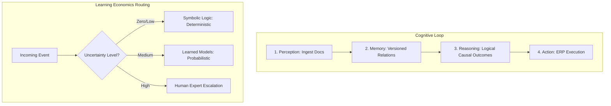

# Strategic Analysis: The Manifold Enterprise Model

This document provides a comprehensive summary of **"The Manifold Enterprise: Re-Engineering Business Cognition"** and translates its core mathematical concepts and cognitive architectures into concrete simulation features for our **ARIA Manifold** application.

---

## 1. Core Paradigm Shift: Flat-Space vs. Manifold

The paper introduces a critique of legacy enterprise architectures (ERP/SaaS) and contrasts them with the geometric computing model proposed by ARIA:

*   **The Flat-Space Paradigm (Legacy)**: Business processes are recorded by flattening them into static, disjointed text documents, tabular spreadsheets, and post-hoc checklists. The actual runtime connecting these systems lives manually inside employees' heads via meetings, emails, and reconciliations, creating massive coordination friction.
*   **The Manifold Paradigm (ARIA)**: Represents every corporate entity, decision, and transaction as dynamic coordinates on a continuous, governed, n-dimensional manifold. Trajectories on this manifold model computed processes, offering algebraic guarantees of compliance and mathematical optimizations of workflows.

---

## 2. The Four Pillars of the Enterprise Manifold

To model high-dimensional enterprise operations, the paper utilizes four primary mathematical structures:

### I. The Atlas (Category Theory – Lawful Mapping)
*   **Concept**: Manifolds are mapped through overlapping charts linked by lawful transition maps. ARIA uses Category Theory to define:
    *   **Objects**: Typed organizational states (e.g., invoice received, compliance approved).
    *   **Morphisms**: Governed processes that transform states (must compose algebraically).
    *   **Functors**: Mappings between different business domains (e.g., linking supply chain to finance ledger charts).
*   **Core Rule**: Business operations must compose algebraically or not at all.

### II. The Metric (Differential Geometry – Curvature & Geodesics)
*   **Concept**: The manifold carries an operational metric representing distance and curvature:
    *   **Geodesic**: The mathematically shortest, most efficient, lawful path between two business states.
    *   **Curvature**: Areas where small variations in initial conditions cause massive divergences in outcomes (representing high risk).
*   **Audit Logic**: Risk assessment is localized; audit resources are dynamically channeled to high-curvature zones.

### III. The Flow (Lorenz Dynamics – Coupled Flows)
*   **Concept**: The enterprise is viewed as a continuous flow of coupled signals (cash, inventory, compliance obligations).
*   **Audit Logic**: ARIA monitors volatility triggers and phase-transition precursors in real time, defining organizational stability as an active dynamical property rather than a static checkbox.

### IV. The Arrow (Negentropy – Structural Order)
*   **Concept**: Left ungoverned, AI applications increase systemic entropy (disorder, sprawling outputs, policy drift).
*   **Core Metric**: ARIA serves as a negentropy engine: converting raw, high-uncertainty data into structured, evidenced order. Order created per token is measured as a core metric.

---

## 3. Cognitive Architecture & Learning Economics

### The Connectome Architecture
Cognitive functions reside in the wiring topology (connectome) rather than individual nodes. ARIA deploys a four-layer runtime:
1.  **Perception**: Ingests and contextualizes multi-source documents.
2.  **Memory**: Version-controlled repository of relationships.
3.  **Reasoning**: Evaluates logical rules and causal outcomes.
4.  **Action**: Translates decisions into real-world ERP executions (BAPIs/RFCs).

### Optimizing Understanding per Joule
Instead of raw capability-per-query, ARIA introduces an economic objective function: **optimizing understanding per joule**. Transactions are dynamically routed:
*   *Deterministic Operations* (e.g., three-way invoice matching) $\rightarrow$ **Symbolic Logic**.
*   *Probabilistic Decisions* (e.g., risk scoring) $\rightarrow$ **Learned Models**.
*   *Unstructured Exceptions* $\rightarrow$ **Human Experts**.

---

## 4. Proposal for ARIA Manifold Dashboard Simulation

To reflect these concepts in our UI mockup, we can enhance the dashboard with the following features:

### A. Dynamic Category Theory Log Morphisms
In the **Agent Ledger Activity log**, we can inject entries verifying algebraic composition:
- `[Morphism Composition] Verified BKPF (Header) -> BSEG (Item) composition is algebraically lawful.`
- `[Atlas Transition] Mapping functor: [Procurement Chart] -> [Treasury Ledger Chart] ... SUCCESS.`

### B. Geodesic & Curvature Metrics
Add a new **"Geometric Performance"** panel under the simulation sandbox showing:
- **Geodesic Efficiency Index**: $94.6\%$ (Current path deviation from mathematically shortest path).
- **Curvature Hotspots**: List of high-curvature transactions (e.g., "ASML cross-border pricing anomaly showing sensitivity spike: $\kappa = 8.2$").

### C. Negentropy Meter
Add a KPI card detailing:
- **System Negentropy**: $+14.2\text{ bits/token}$ (representing the structural order created by LLM processing of raw SAP OData packets).

### D. Stratified Routing Breakdown
Show a small visual breakdown of routed transactions:
- **Symbolic Logic (Deterministic)**: $82\%$
- **Probabilistic Models (Learned)**: $16\%$
- **Human Escalations (Exceptions)**: $2\%$
